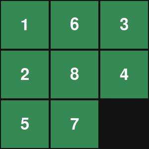

# Python Sliding Tile Puzzle Solver

This Python repository contains the structure for a sliding tile puzzle, as well as the code required to solve the maze.
When the `main.py` file is ran, it will open a pygame window for the visual representation of the puzzle. The puzzle will then be solved immedietly by the program.
The number of moves it took to solve the puzzle will be printed in the console.

|  |
|:--:|
| *A.1 The puzzle being solved* |

## `heap.py` file
This file contains a class definition for the heap data structure used by A*.

## `functions.py` file
This file contains a variety of helper functions used throughout the other files. These include the A* algorithm itself, functions for encoding and decoding the tile data, and and functions to make sure the game state is solvable before attempting to solve it.
